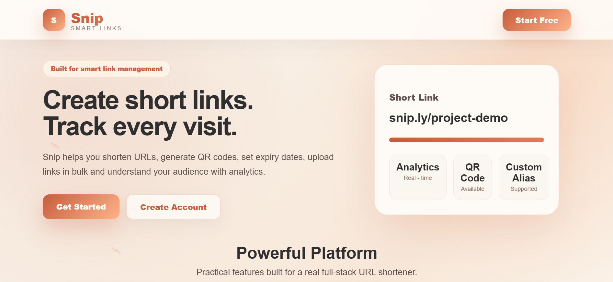
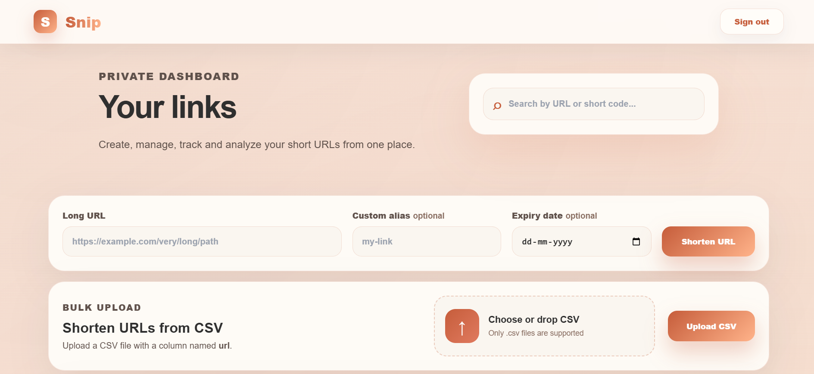
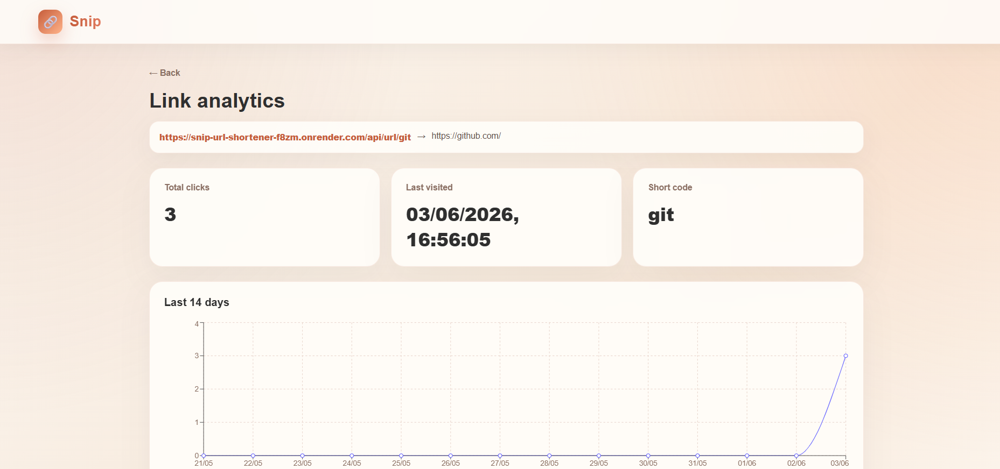
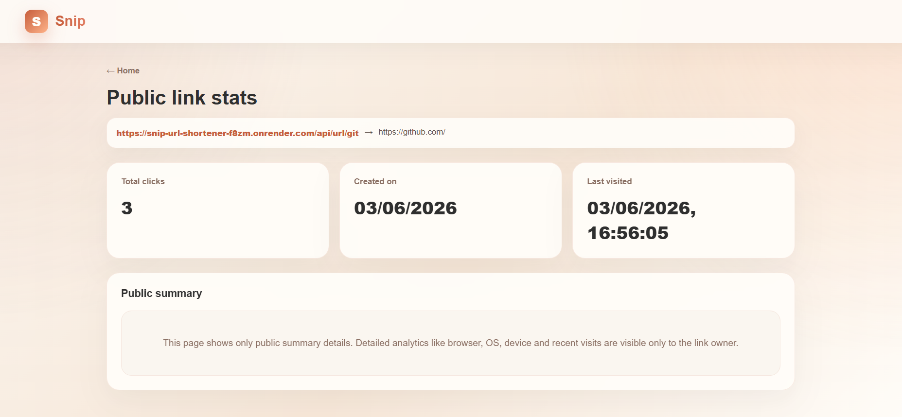
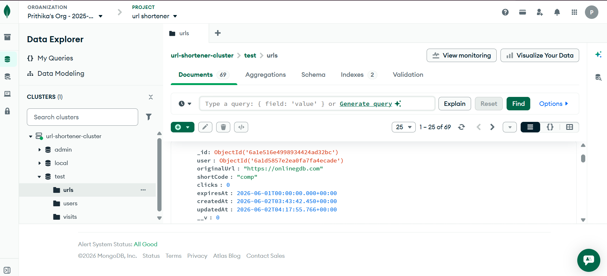
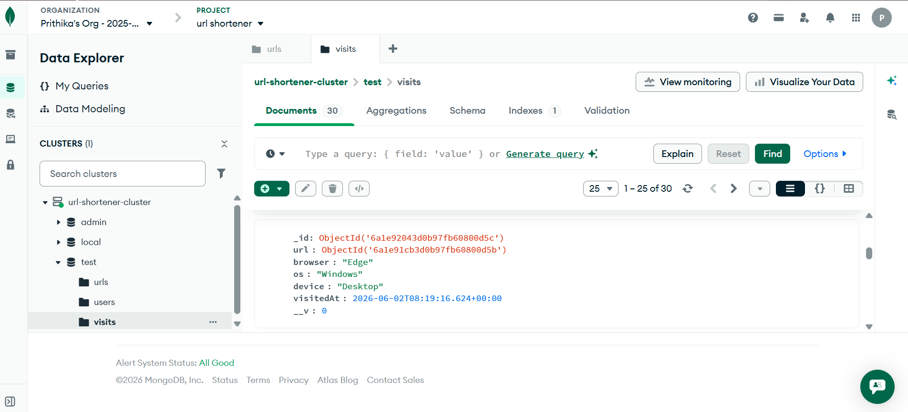

# Snip - Smart URL Shortener with Analytics

## Project Overview

Snip is a modern full-stack MERN URL Shortener application that allows users to create, manage, and track shortened URLs through a professional dashboard.

The application provides authentication, URL shortening, analytics tracking, QR code generation, CSV bulk upload, password reset functionality, Google Sign-In, and public statistics pages.

---

## Live Demo

Frontend: https://snip-url-shortener-inky.vercel.app/

Backend: https://snip-url-shortener-f8zm.onrender.com

---

## Demo Video

Demo Video: https://youtu.be/zymmO3I9V5M

---

## Features

### Authentication

* User Signup
* User Login
* JWT Authentication
* Google Sign-In using Firebase Authentication
* Forgot Password via Email
* Reset Password
* Protected Dashboard Routes

### URL Shortening

* Create short URLs from long URLs
* Unique short code generation
* Custom alias support
* URL validation
* Server-side redirection
* Link expiry support

### Dashboard

* View all created URLs
* Copy short URL
* Edit destination URL
* Delete URL
* Search URLs
* Responsive interface

### Analytics

* Total click count
* Last visited timestamp
* Recent visit history
* Device analytics
* Browser analytics
* Operating system analytics
* Daily click trend charts

### Public Stats

* Public statistics page
* Accessible without login
* Displays limited public analytics
* Protects detailed private analytics

### Additional Features

* QR Code Generation
* QR Code Download
* Bulk URL Creation via CSV Upload
* Responsive Design
* Modern UI
* Loading Animations
* Toast Notifications
* Delete Confirmation Modal

---

## Tech Stack

### Frontend

* React
* React Router DOM
* Axios
* Recharts
* React Icons
* QRCode React
* Firebase Authentication

### Backend

* Node.js
* Express.js
* MongoDB
* Mongoose
* JWT
* Bcrypt.js
* Multer
* Nodemailer
* CSV Parser
* UA Parser

### Database

* MongoDB Atlas

### Deployment

* Frontend: Vercel
* Backend: Render

---

## Project Architecture

 User
  |
  v
React Frontend (Vercel)
  |
  v
Express Backend API (Render)
  |
  v
MongoDB Atlas

Additional Services:
- Firebase Authentication
- Nodemailer
- QRCode Generator
- CSV Upload Service
- Analytics Tracking

---

## Setup Instructions

### Clone Repository

```bash
git clone https://github.com/prithikavasan/snip-url-shortener.git
cd snip-url-shortener
```

### Backend Setup

```bash
cd backend
npm install
npm start
```

### Frontend Setup

```bash
cd frontend
npm install
npm run dev
```

---

## Environment Variables

### Backend (.env)

```env
MONGO_URI=your_mongodb_connection_string

JWT_SECRET=your_jwt_secret

FRONTEND_URL=your_frontend_url

EMAIL_USER=your_email

EMAIL_PASS=your_app_password
```

### Frontend (.env)

```env
VITE_API_URL=https://snip-url-shortener-f8zm.onrender.com
```

---

## Assumptions Made

* Users must be authenticated to manage their URLs.
* Short URLs are public because they are intended for sharing.
* Public Stats pages are accessible without login.
* Detailed analytics are available only to the authenticated owner.
* Expired links cannot be redirected.
* CSV upload expects a column named `url`.

---

## AI Planning Document

### Planning Steps

1. Analyze the hackathon problem statement.
2. Design authentication workflow.
3. Design MongoDB schema for Users, URLs, and Visits.
4. Implement URL shortening logic.
5. Implement analytics tracking.
6. Build REST APIs.
7. Develop React frontend.
8. Implement QR generation.
9. Implement CSV bulk upload.
10. Implement public stats page.
11. Improve UI/UX.
12. Deploy application.
13. Test all features.

---

## API Overview

### Authentication APIs

```text
POST /api/auth/signup
POST /api/auth/login
POST /api/auth/google-login
POST /api/auth/forgot-password
PUT  /api/auth/reset-password/:token
```

### URL APIs

```text
POST   /api/url/create
GET    /api/url/my-urls
GET    /api/url/analytics/:id
PUT    /api/url/:id
DELETE /api/url/:id
POST   /api/url/bulk
GET    /api/url/public/:shortCode
GET    /api/url/:shortCode
```

---

## Sample Outputs

### Home Page



### Dashboard



### Analytics Page



### Public Stats Page



### MongoDB URL Collection



### MongoDB Visit Collection



---

## Future Improvements

* Custom domains
* Advanced geolocation analytics
* Team workspaces
* Export analytics reports
* Dark mode support
* API rate limiting

---

## Author

Prithika Sri S

B.Tech Information Technology
Sri Shakthi Institute of Engineering and Technology

---

This project is a part of a hackathon run by https://katomaran.com
